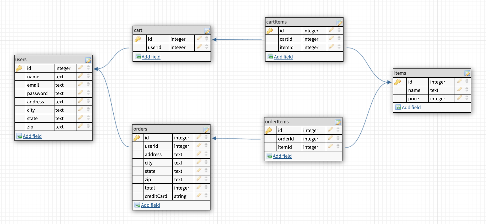

# Sweet-A-Holics

## Overview

---
A local bakery website that specializes in cinnamon rolls and other sweets. Works like an e-commerce site where users can place orders on a number of sweets and can view details on each one.

## User Stories

---
1. The user arrives on the home page which contains aesthetics and a welcome message with links to login/signup
2. The user can either login or signup, entering the pertinent information, which will then take them to the main Sweetaholics product page.
3. The product page shows all the sweets available to purchase, with information such as the name, price, and a picture. 
4. Since this is the logged-in state, the user has options to go back to the home page, access their existing cart, look at a list of past orders, as well as logout, which will bring them back to the home page.
5. When a user clicks on a particular bakery item, they're taken to that particular item page with a bit more info like a description.
6. Users can add treats to their cart from this page and can even click additional times to continue adding the same item to the cart.
7. The My Cart page will have a running list of all the items the user bought which contains the grand total, as well as a checkout button.
8. Users can also delete items from their cart on this page.
9. Checking out from this screen takes the user to a payment info screen, and once everything is finalized, the order is made and the user is sent to the My Orders page.
10. While this page is also accesible from other pages, this screen shows every order the user has made, with an appropriate date.
11. When the user clicks this date, they will see a full receipt and all the info they entered when they made this purchase. 

 

## Wireframes & ERD

---

## Routes Inventory

---

| Route       | Description |
| ----------- | ----------- |
| POST /users/signup | add a new user to users table |
| POST /users/login  | send info to back to check password and send user info to the front |
| GET /users/verify | get user info to display profile | 

## MVP Checklist

---
- Login/Logout functionality
    - JWT and hashing
- Nav Bar and page switching/hiding (Routes/Redirects)
- Product database entry/seeding
- Cart functionality (add/remove)
    - Order functionality

## Stretch Goals

---
- Add a quantity for each item, so they have the potential to "run out" and not be available.
- Add admin user capability, so they see certain pages like "Manage Products" and "Orders to Fill"
    - Manage Products: List of products where admin can adjust the quantity
        - Bonus: Admins can add, edit, and delete products
    - Orders to Fill: Admins can convert orders from "pending" to "shipped"

